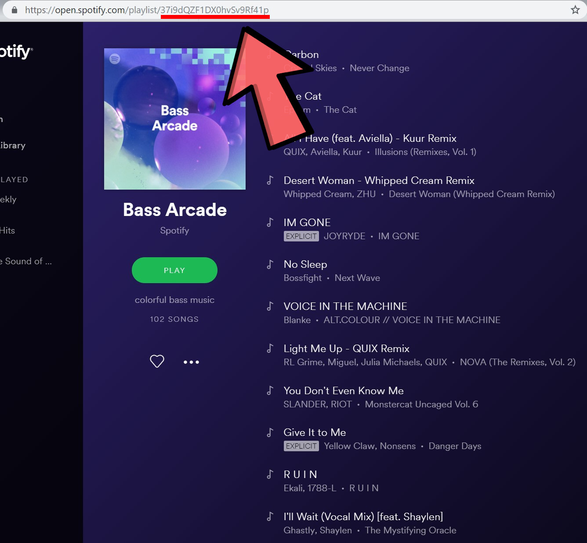
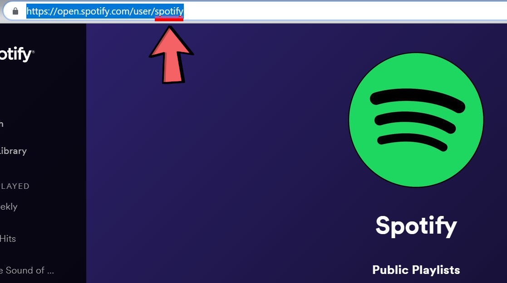

**This application is a work in progress and purely for demonstration purposes. Fetching by User ID and Playlist ID is currently unavailable, but will be a feature to get sorted out soon.**

# Spotify Research Assistant
Ever wanted to know how energetic and happy your music can sound? Pick your playlist and get data on your music!

## Usage

### Logging in with your account
You can log in with your Spotify account and the Researcher app will pull from your best playlist or artists and generate technical audio results not available through regular Spotify use!

### Getting a playlist ID:

### Getting a user ID:

### Using the App
Take the IDs you have just found through the URLs of your playlist/user of choosing, input into their fields in the app, and submit!

To fetch another playlist's data, refresh the page and repeat the process.
